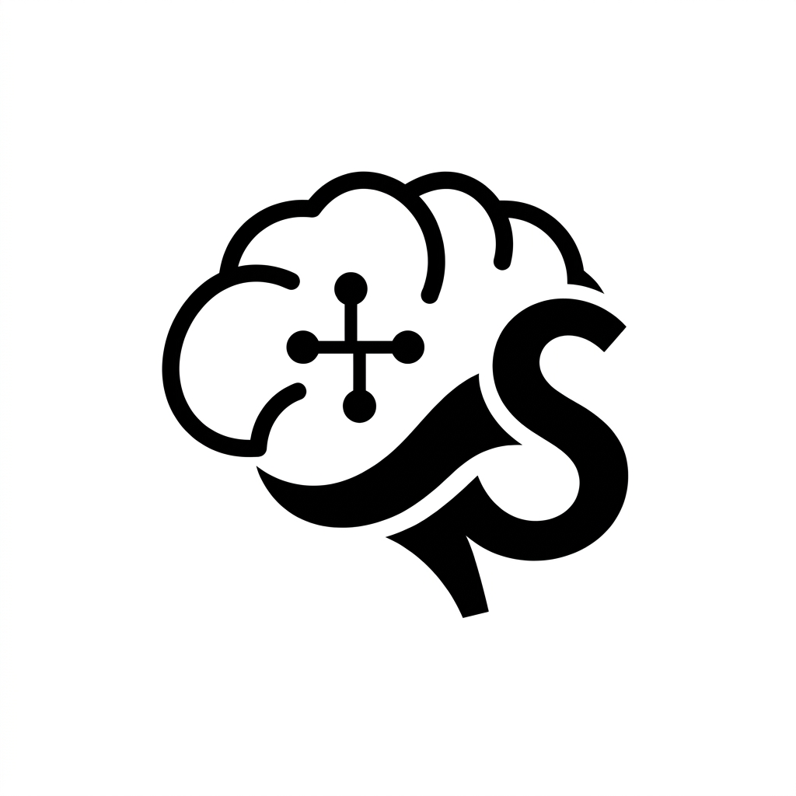

<div align="center">
  
  <h1>Suqoon</h1>
  <p><em>Software That Breathes.</em></p>

  <p>
    <a href="#"></a>
    <a href="#"></a>
    <a href="#"></a>
    <a href="#"></a>
  </p>
</div>

---

## ✦ The Vision

*In a noisy digital landscape, Suqoon introduces absolute clarity. We architect cognitive software and engineered interfaces designed to accelerate workflows without sensory overload. Intelligence should feel like a natural extension of thought.*

## ✦ About the Project

Suqoon is a highly-optimized AI interface and platform architecture. Designed for uncompromising speed and minimal friction, it combines deep AI workflows with an immaculate, distraction-free modern UI. Whether exploring our core product or utilizing our specialized architectural services, Suqoon is built to eradicate technological bottlenecks and elevate daily operations.

## ✦ Core Features

*   **Zero-Friction Cognitive Assistant:** A non-intrusive, context-aware AI entity that floats seamlessly over your workspace to provide immediate architectural insights.
*   **Fluid & Responsive Geometry:** Interfaces driven by spring physics and smooth-scroll mechanics, reducing the cognitive load of navigation.
*   **Engineered Scalability:** Built on the bleeding edge of modern component architecture—designed to scale effortlessly while remaining exceptionally lightweight.
*   **Integrated Solutions Architecture:** Extensible foundation supporting custom AI deployment, automation systems, and high-availability cloud topologies.

## ✦ Tech Stack

**Frontend Architecture**
*   [React 19](https://react.dev/) — Next-generation rendering capabilities.
*   [Vite 8](https://vitejs.dev/) — Lightning-fast HMR and optimized build cycles.
*   [Tailwind CSS](https://tailwindcss.com/) — Utility-first, precision styling engine.

**Animation & Interaction**
*   [Framer Motion](https://www.framer.com/motion/) — Physics-based UI animations.
*   GSAP & Lenis — Premium scroll interpolation and sequencing.

## ✦ Demo Preview


*(A live deployment link will be provided here shortly.)*

---

## ✦ Installation & Setup

Get Suqoon running in your local environment in seconds.

```bash
# Clone the repository
git clone https://github.com/MdIbuA/Suqoon.net.git

# Navigate into the project directory
cd Suqoon.net

# Install dependencies
npm install

# Initialize the local development server
npm run dev
```

## ✦ Usage

Once the local server is running, navigate to `http://localhost:5173`. 
The floating AI assistant can be accessed in the lower right corner. Custom service architectures and routing can be modified via the `src/components/Navbar.jsx` mega menu definitions.

---

## ✦ Project Structure

```text
Suqoon.net/
├── public/                 # Static assets
├── src/
│   ├── assets/             # Branding and optimized imagery
│   ├── components/         # Modular React components (Hero, FloatAssistant, etc.)
│   ├── index.css           # Global Tailwind directives & token system
│   ├── main.jsx            # React root injection point
│   └── mountAssistant.jsx  # Isolated renderer for the AI Assistant
├── index.html              # Main application shell
├── vite.config.js          # Build configuration & proxy rules
└── tailwind.config.js      # Design system configurations
```

## ✦ Roadmap

- [ ] **Phase 1:** Core landing experience and animation finalization.
- [ ] **Phase 2:** Connect Floating Assistant to a live LLM endpoint for real-time interaction.
- [ ] **Phase 3:** Dark/Light mode synchronization utilizing the `next-themes` specification.
- [ ] **Phase 4:** Official open-source release with full architectural documentation.

## ✦ Contributing

Contributions make the open-source community an incredible place to learn, inspire, and create. Any robust architectural updates or aesthetic refinements you contribute are **greatly appreciated**.

1. Fork the Project
2. Create your Feature Branch (`git checkout -b feature/AmazingArchitecture`)
3. Commit your Changes (`git commit -m 'Add state-of-the-art Architecture'`)
4. Push to the Branch (`git push origin feature/AmazingArchitecture`)
5. Open a Pull Request

## ✦ License

Distributed under the MIT License. See `LICENSE` for further details.

## ✦ Connect

Maintainer: **Your Name**  
Email: hello@suqoon.net  
Project Link: [https://github.com/MdIbuA/Suqoon.net](https://github.com/MdIbuA/Suqoon.net)

<br />
<p align="center">
  <code>███████╗██╗   ██╗ ██████╗  ██████╗  ██████╗ ███╗   ██╗</code><br />
  <code>██╔════╝██║   ██║██╔═══██╗██╔═══██╗██╔═══██╗████╗  ██║</code><br />
  <code>███████╗██║   ██║██║   ██║██║   ██║██║   ██║██╔██╗ ██║</code><br />
  <code>╚════██║██║   ██║██║▄▄ ██║██║   ██║██║   ██║██║╚██╗██║</code><br />
  <code>███████║╚██████╔╝╚██████╔╝╚██████╔╝╚██████╔╝██║ ╚████║</code><br />
  <code>╚══════╝ ╚═════╝  ╚══▀▀═╝  ╚═════╝  ╚═════╝ ╚═╝  ╚═══╝</code><br />
</p>
